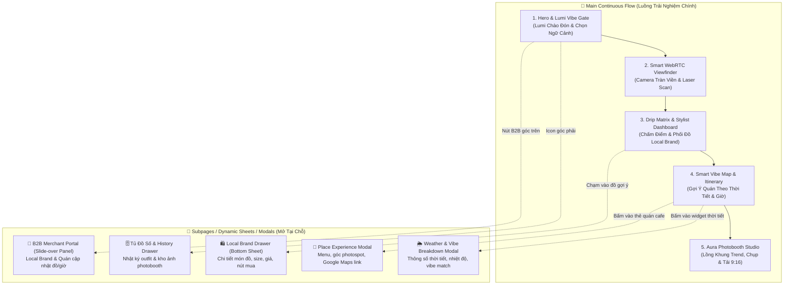
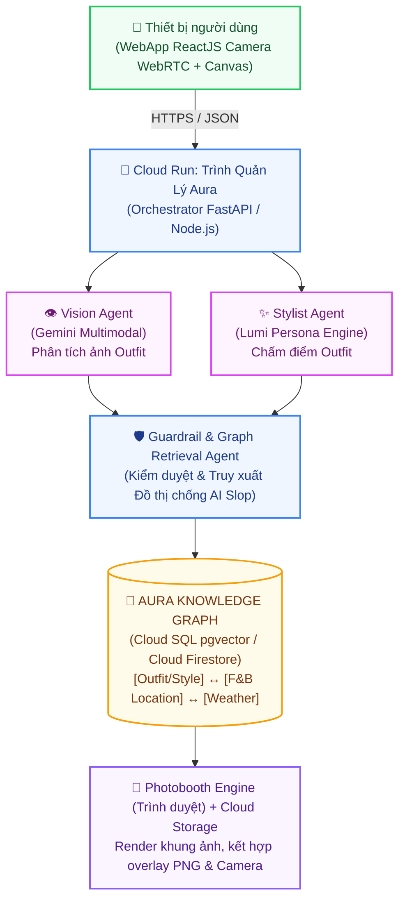
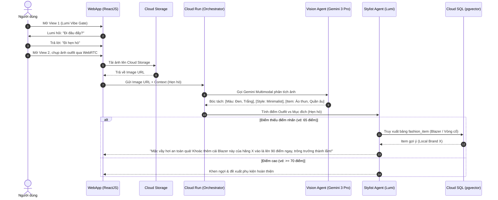
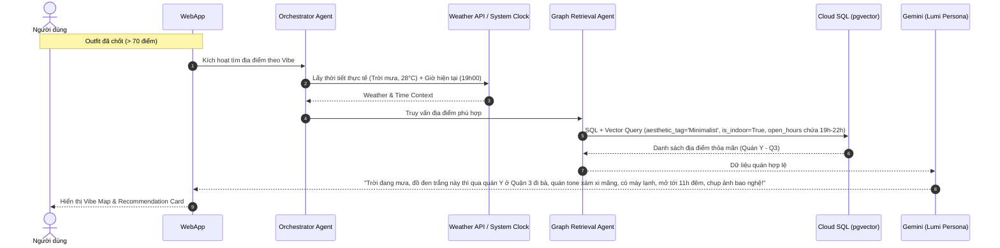
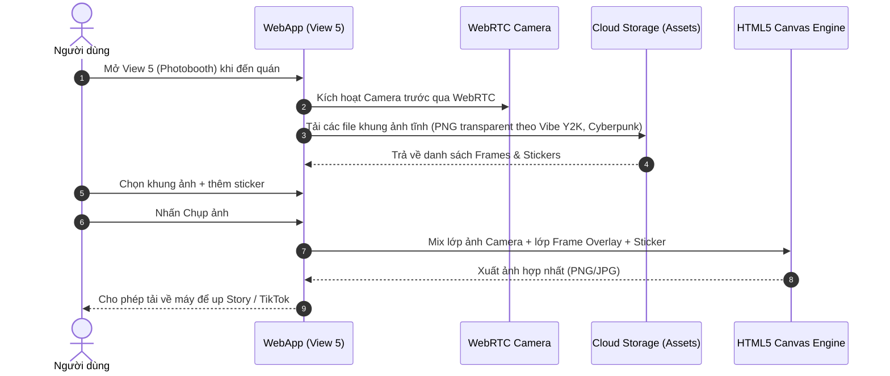

# AURALENS — BÁO CÁO TỔNG HỢP & LỘ TRÌNH TRIỂN KHAI TỪ A-Z
**Dành cho:** AI Riser Vietnam 2026 · #BuildwithGoogleAI · Mục tiêu Hạng Vàng/Bạch Kim

---

## PHẦN 1 — TỔNG QUAN DỰ ÁN

### 1.1 Branding & Visual Identity
- **Tên:** AuraLens — *"Thấu Kính Khí Chất - Bắt Trọn Vibe Của Riêng Bạn"*
- **Định vị:** Một Stylist Số & Bản đồ Trải nghiệm Cá nhân hóa (Personalized Stylist & Experience Map) dành riêng cho Gen Z. Nó không chỉ đánh giá trang phục bạn đang mặc, mà còn thiết kế nguyên một buổi đi chơi dựa trên phong cách đó.
- **Trợ lý ảo đại diện:** Nhân vật ảo (AI Persona) tên là **Lumi** — một trợ lý ảo siêu "trendy", nói chuyện với ngôn ngữ mạng xã hội hóm hỉnh, am hiểu thời trang và tràn đầy năng lượng tích cực.
- **Nhận diện & Bảng màu (Vibrant Cyber-Pop & Neo-Y2K Glassmorphism):**
  - Giao diện camera tràn viền mang âm hưởng Y2K / Cyber-Pop tươi sáng, rực rỡ, loại bỏ cảm giác u tối nhàm chán.
  - **Bảng màu Dopamine & Radiant Palette:**
    - **Electric Lime / Cyber Acid:** `#D4FF00` (Năng lượng, điểm số cao, CTA bùng nổ).
    - **Candy Pink / Y2K Bubblegum:** `#FF2E93` (Điểm nhấn thời trang, fashion highlight).
    - **Vibrant Cyber Cyan / Aqua Glow:** `#00F5FF` (Quét camera WebRTC, tia laser scanner).
    - **Ultra Violet / Lavender Pop:** `#7C3AED` & `#C084FC` (Màu đại diện của Lumi AI).
    - **Nền chủ đạo (Fresh Light / Glass Neutral):** Gradient trắng sữa pha ánh tím ngọc trai (`#FAFAFC` $\rightarrow$ `#F0F3FF`) kết hợp các thẻ kính mờ nhiều màu sắc (*Frosted Glassmorphism with Colorful Blurs & Holographic Borders*).
  - **Typography (Dynamic & Trendsetting):**
    - Headings/Brand: `Syne` / `Clash Display` (Đậm nét, High-Fashion, cá tính).
    - Body UI: `Plus Jakarta Sans` / `Outfit` (Hiện đại, siêu rõ nét trên mobile).
    - Metrics/Scores: `Space Grotesk` / `JetBrains Mono` (Công nghệ, dứt khoát).

### 1.2 Lý do kết hợp các chủ đề gốc
AuraLens là sự giao thoa hoàn hảo của 4 bài toán từ đối tác chương trình:
- **#14 — Thiết kế hành trình cá nhân hoá** (Cốt lõi của hệ thống)
- **#6 — Kết nối cung cầu F&B và Không gian**
- **#12 — Dự báo xu hướng** (Thu thập dữ liệu OOTD của giới trẻ)
- **#11 — Chuyển đổi xanh** (Ưu tiên gợi ý second-hand local brands hoặc quán cafe đạt chuẩn xanh).

> **Hệ sinh thái khép kín:** Tủ đồ số $\rightarrow$ Đánh giá phong cách $\rightarrow$ Lên lịch trình đi chơi $\rightarrow$ Chụp ảnh kỷ niệm.  
> Mọi dữ liệu đều xoay quanh một **Đồ thị Thực thể (Entity Graph)** tập trung, lưu trữ thông tin về người dùng, sản phẩm thời trang, địa điểm và thời tiết.

### 1.3 Stakeholder
- **Người dùng chính:** Gen Z, sinh viên, người đam mê thời trang, tín đồ sống ảo muốn tìm các địa điểm check-in "độc bản" không đụng hàng.
- **Khách hàng B2B:** Local Brands (thương hiệu thời trang nội địa) muốn AI gợi ý đồ của họ cho người dùng; Quán Cafe / Studio / Pub muốn thu hút tệp khách trẻ.
- **Điểm mạnh:** Ứng dụng WebApp (chạy trên trình duyệt điện thoại) không cần cài đặt. Có thể viral cực mạnh trên TikTok thông qua tính năng Photobooth.

### 1.4 Use case chính (Tính năng cốt lõi)
1. **Giao tiếp với Lumi (AI Persona):** Khi vào App, Lumi (Nhân vật AI) sẽ hỏi thăm và nắm bắt tâm trạng: *"Hôm nay diện đồ đi hẹn hò hay đi quẩy thế bà ơi?"*. Lumi sẽ tùy chỉnh giọng điệu (Vibe) theo câu trả lời của người dùng.
2. **Drip Check (Chấm điểm Outfit):** Người dùng chụp ảnh bằng camera. AI chấm điểm (0-100đ).
   - **Điểm < 70đ (Chưa "tới" vibe):** Lumi gợi ý thay đổi (Alternative), ví dụ: *"Bỏ cái áo khoác nỉ ra, thay bằng áo ống (tube top) là chuẩn Y2K luôn!"*.
   - **Điểm > 70đ (Đã "cháy"):** Lumi khen ngợi, gợi ý thêm phụ kiện làm điểm nhấn (kính râm, túi xách) để bộc lộ cá tính mạnh hơn.
3. **Đề xuất Địa điểm & F&B Real-time:** Dựa trên outfit vừa chấm, Lumi sẽ gợi ý quán cafe, nhà hàng hoặc khu vui chơi. AI kiểm tra nghiêm ngặt: Giờ mở cửa hiện tại, thời tiết (trời đang mưa thì chỉ gợi ý quán có trong nhà), và tính toán lộ trình thời gian hợp lý.
4. **Photobooth Filter Y2K/Cyberpunk:** Khi đến địa điểm, người dùng mở tính năng Photobooth trên WebApp. Ứng dụng cung cấp các khung ảnh (frames) và sticker theo đúng Vibe của địa điểm và trang phục. Chụp xong tải về điện thoại để up story.

### 1.5 Giá trị mang lại
- **Cho Gen Z:** Giải quyết triệt để câu hỏi *"Hôm nay mặc gì?"* và *"Mặc bộ này thì đi đâu chụp ảnh?"*.
- **Cho Doanh nghiệp:** Nền tảng quảng cáo (Targeted Ads) chính xác nhất — gợi ý trực tiếp sản phẩm local brand hoặc địa điểm F&B vào đúng lúc người dùng đang lên đồ đi chơi.
- **Đạt tiêu chí cuộc thi:** Sử dụng mạnh mẽ Gemini Multimodal (Thị giác máy tính) và hệ sinh thái Google (Cloud Run, Cloud SQL / Firestore) hoàn toàn ở định mức Zero-Cost.

### 1.6 Nghiên cứu tính khả thi
- Thị trường thời trang và ăn uống của giới trẻ tại TP.HCM là khổng lồ. Tuy nhiên, giới trẻ đang mệt mỏi với các bài review ẩm thực "seeding" (quảng cáo giả tạo) trên Facebook/TikTok. AuraLens cung cấp gợi ý cá nhân hóa dựa trên dữ liệu thật.
- **Hướng kiếm tiền:**
  - **Người dùng:** Miễn phí hoàn toàn.
  - **Local Brands / F&B:** Trả phí "Boost" để sản phẩm/địa điểm của họ xuất hiện dưới dạng "Alternative Recommendation" (gợi ý thay thế) khi người dùng check outfit, hoặc tài trợ khung ảnh Photobooth mang logo thương hiệu.

### 1.7 Yêu cầu phi chức năng (NFR)
- Xử lý hình ảnh (Computer Vision) qua Gemini API phải trả kết quả dưới 3 giây.
- Gợi ý F&B không được phép sai lệch thực tế (Không được gợi ý quán đã đóng cửa hoặc địa điểm ảo) $\rightarrow$ Giải quyết bằng GraphRAG & Grounding.
- Chi phí hạ tầng = 0. Tận dụng gói Starter Tier cho phép các ứng dụng Full-stack trên Cloud Run và Firestore/Cloud SQL miễn phí.

### 1.8 Yêu cầu chức năng (FR)
- Giao diện Camera (WebRTC) để chụp outfit trực tiếp trên trình duyệt.
- Trợ lý AI (Lumi) có bộ nhớ hội thoại để hiểu ngữ cảnh.
- Chấm điểm outfit và sinh đề xuất thay đổi dựa trên logic Graph.
- Engine gợi ý F&B: Lọc cơ sở dữ liệu dựa trên Vibe của outfit, Thời tiết, Giờ mở cửa.
- Canvas Editor (Photobooth): Chụp ảnh, chèn lớp phủ (overlay), sticker và xuất file PNG/JPG.
- Cổng thông tin (Merchant Portal) cho Local Brand cập nhật quần áo và quán cafe cập nhật giờ mở cửa.

### 1.9 Kiến trúc Trải nghiệm & Điều hướng (Senior UI/UX Architecture)
Thay vì chia thành 10 trang web riêng biệt gây rời rạc và load chậm, AuraLens được thiết kế theo **Kiến trúc Trải nghiệm Liền mạch (App-like Continuous Flow + Interactive Subpages / Bottom Sheets / Drawers / Modals)**:



---

## PHẦN 2 — KIẾN TRÚC & TOPOLOGY CHI TIẾT

### 2.1 Sơ đồ tổng thể



> **Ghi chú:** Để chống ảo giác (AI Slop) - việc LLM tự sinh ra một quán cafe hoặc một nhãn hàng không tồn tại, Guardrail Agent ép mô hình Gemini chỉ được phép sinh câu trả lời bằng cách nối các Node thực tế lưu trong GraphRAG.

### 2.2 Mô hình dữ liệu (Entity Graph Schema)
Dùng **PostgreSQL** với extension `pgvector` trên Cloud SQL (hoặc Cloud Firestore Vector Search):

- **BẢNG `user_profile`:**  
  `id (uuid)`, `name`, `dob`, `preferred_vibes`, `tenant_id`
- **BẢNG `fashion_item` (Đồ của Local Brand):**  
  `id (uuid)`, `brand_name`, `category`, `colors`, `aesthetic_tag`, `image_url`, `buy_link`
- **BẢNG `location` (F&B / Photospot):**  
  `id`, `name`, `type (Cafe/Pub/Museum)`, `aesthetic_tag`, `gps`, `is_indoor`, `open_hours`
- **BẢNG `session_log` (Tiến trình của người dùng):**  
  `id`, `user_id`, `uploaded_image_url`, `fit_score`, `weather_context`, `timestamp`
- **BẢNG `rule_engine` (Chứa các nguyên tắc thời trang cho Lumi):**  
  `id`, `base_style`, `missing_element`, `recommendation_text`

### 2.3 Luồng xử lý chi tiết (Sequence Flow)

#### A. Luồng "Fit Check & Stylist (Lumi)"

- Người dùng mở View 1 (Lumi Vibe Gate), Lumi hỏi: "Đi đâu đấy?" $\rightarrow$ Người dùng: "Đi hẹn hò".
- Người dùng mở View 2, chụp ảnh outfit. Ảnh được đẩy lên Cloud Storage, URL gửi về Vision Agent (Cloud Run).
- Vision Agent gọi Gemini Multimodal bóc tách: `[Màu: Đen, Trắng]`, `[Style: Minimalist]`, `[Item: Áo thun, Quần âu]`.
- Stylist Agent (Lumi) tính điểm dựa trên sự phù hợp giữa Outfit và Mục đích (Hẹn hò).
- Nếu thiếu điểm nhấn (vd: 65 điểm), Lumi truy xuất bảng `fashion_item` tìm một chiếc áo khoác Blazer hoặc vòng cổ (Alternative) và sinh câu trả lời: *"Mặc vầy hơi an toàn quá! Khoác thêm cái Blazer này của hãng X vào là lên 90 điểm ngay, trông trưởng thành lắm!"*.

#### B. Luồng "F&B Recommendation" (Gợi ý ăn chơi)

- Khi Outfit đã "chốt" (đạt > 70đ), Orchestrator Agent kích hoạt tìm địa điểm.
- Hệ thống bắt API thời tiết thực tế (vd: Trời đang mưa, 28 độ). Lấy giờ hệ thống (vd: 19h00).
- Graph Retrieval Agent truy vấn SQL kết hợp Vector: Tìm các bản ghi `location` có `aesthetic_tag = "Minimalist"`, `is_indoor = True` (vì trời mưa), và `open_hours` chứa khung giờ 19h-22h.
- Gemini tổng hợp lại bằng giọng của Lumi: *"Trời đang mưa, đồ đen trắng này thì qua quán Y ở Quận 3 đi bà, quán tone xám xi măng, có máy lạnh, mở tới 11h đêm, chụp ảnh bao nghệ!"*.

#### C. Luồng "Aura Photobooth"

- Khi đến quán, người dùng mở View 5. WebRTC gọi lại Camera trước.
- WebApp tải xuống các file khung ảnh tĩnh (PNG transparent) từ Cloud Storage được phân loại theo Vibe (vd: khung Y2K, khung Cyberpunk).
- Người dùng chọn khung, thêm sticker.
- Tính năng Canvas (HTML5) mix lớp ảnh Camera và lớp Frame lại thành một tấm ảnh hợp nhất $\rightarrow$ Lưu về máy.

### 2.4 Mô hình tối ưu Zero-Cost & Chống AI Slop
- **Giới hạn 2 App của Starter Tier:** Đóng gói toàn bộ logic Backend (các Agent) vào 1 container Cloud Run duy nhất. Frontend là 1 ứng dụng React tải dưới dạng file tĩnh (Static hosting trên Firebase) hoặc container thứ 2.
- **Tiết kiệm API Gemini:** Tính năng định vị (GPS), thời tiết, và kiểm tra giờ mở cửa của quán được xử lý hoàn toàn bằng logic code (`if/else` và SQL query) ở tầng backend, không dùng Gemini để tiết kiệm token và đảm bảo độ chính xác tuyệt đối 100%.

---

## PHẦN 3 — LỘ TRÌNH TRIỂN KHAI TỪNG BƯỚC (A-Z)

| Giai đoạn | Thời lượng | Nội dung công việc |
| :--- | :--- | :--- |
| **Giai đoạn 0 — Chuẩn bị** | 1 ngày | - Kích hoạt Google Cloud Project (Starter Tier), Cloud Run, Cloud SQL Admin, Cloud Storage, Firebase, Vertex AI/Gemini API.<br/>- Thiết kế nhân vật Lumi (Viết prompt "Persona" cho System Instruction của Gemini). |
| **Giai đoạn 1 — Dựng Schema & Data** | 1 ngày | - Khởi tạo Cloud SQL PostgreSQL (bật `pgvector`) hoặc Cloud Firestore.<br/>- Nhập dữ liệu mồi (Mock Data): 20 món đồ local brand, 15 quán cafe, 10 khung ảnh Photobooth đẩy lên Cloud Storage. |
| **Giai đoạn 2 — Xây dựng Core Agents** | 3 ngày | - Xây `vision-service`: Gọi Gemini Multimodal để đọc ảnh Outfit.<br/>- Xây `stylist-service`: Xử lý logic chấm điểm (Score 0-100) và tìm Alternative items.<br/>- Xây `location-service`: Query Graph DB kiểm tra thời tiết + giờ mở cửa để đề xuất F&B. |
| **Giai đoạn 3 — Giao diện WebApp (Vibe-Coding)** | 3 ngày | - Dùng AI Studio sinh giao diện Camera (WebRTC).<br/>- Giao diện chat của Lumi (hiệu ứng gõ chữ, bong bóng chat).<br/>- Giao diện Photobooth (HTML5 Canvas) & các Subpage Bottom Sheets. |
| **Giai đoạn 4 — Tích hợp & Kiểm thử** | 1.5 ngày | - Nối API Backend vào Frontend. Kiểm tra độ trễ (Latency).<br/>- Test các kịch bản thời tiết (Cố tình set thời tiết giả lập là Mưa để xem Lumi có gợi ý quán ngoài trời không). |
| **Giai đoạn 5 — Triển khai & Demo** | 0.5 ngày | - Deploy lên Cloud Run. Đăng ký Domain miễn phí / Firebase Hosting.<br/>- Quay video demo thực tế ngoài trời (sử dụng điện thoại quay trực tiếp). |

---

## PHẦN 4 — MEGA ONE-SHOT PROMPT CHO GOOGLE AI STUDIO

> Dán nguyên khối dưới đây vào Google AI Studio (chế độ Build/App) để AI Studio hiểu ngữ cảnh và "vibe-code" ra đúng giao diện AuraLens.

```text
Bạn là một kỹ sư phần mềm full-stack cấp cao. Xây dựng cho tôi WebApp "AuraLens" - một Stylist Số và Bản đồ Trải nghiệm cho Gen Z.

1. BỐI CẢNH & BÀI TOÁN
Người dùng cần một ứng dụng WebApp để chấm điểm trang phục (Fit Check), nhận gợi ý phối đồ, tìm địa điểm quán cafe/nhà hàng phù hợp với phong cách đó, và chụp ảnh Photobooth với khung ảnh theo chủ đề. Nhân vật AI dẫn dắt toàn bộ app là "Lumi" - một Gen Z ảo hóm hỉnh.

2. PHONG CÁCH THẨM MỸ (GEN Z VIBRANT & CYBER-POP)
- Tông màu: Sáng, rực rỡ, năng động (Dopamine Palette): Electric Lime (#D4FF00), Candy Pink (#FF2E93), Cyber Cyan (#00F5FF), Violet Glow (#7C3AED), nền kính mờ ngọc trai sáng (#FAFAFC -> #F0F3FF).
- Typography: Tiêu đề dùng font Syne/Clash Display cá tính, nội dung dùng Plus Jakarta Sans, số liệu dùng Space Grotesk.
- Hiệu ứng: Glassmorphism mờ viền phát sáng, Hologram laser scan, micro-animations cực mượt.

3. KIẾN TRÚC HỆ THỐNG & ĐIỀU HƯỚNG
- Frontend: ReactJS, TailwindCSS. Thiết kế Mobile-first (Mobile-web).
- Sử dụng HTML5 WebRTC API để truy cập Camera thiết bị và HTML5 Canvas cho Photobooth.
- Backend giả lập (hoặc chuẩn bị sẵn cho FastAPI): Xử lý luồng Multi-Agent. Mọi phản hồi AI phải kèm theo JSON có cấu trúc (ví dụ: { "score": 85, "comment": "...", "recommendation": [...] }).
- Cấu trúc màn hình dạng Continuous Flow + Interactive Subpage Drawers/Modals:
  * View 1 (Hero & Lumi Vibe Gate): Logo phát sáng, Lumi hỏi ngữ cảnh đi chơi, nút bắt đầu.
  * View 2 (Smart Camera Scanner): Camera tràn viền, khung quét laser scanning animation, nút chụp & upload.
  * View 3 (Drip Matrix Dashboard): Vòng tròn điểm số 3D neon, phân tích màu/chất liệu/style, nhận xét Lumi, Carousel đồ Local Brand + Bottom Sheet chi tiết món đồ.
  * View 4 (Vibe Map & Smart Feed): Widget thời tiết real-time (mưa/nắng), danh sách quán cafe đồng điệu, Modal xem góc chụp & link Google Maps.
  * View 5 (Aura Photobooth Studio): Chọn khung Y2K/Tạp chí, chụp selfie qua Canvas, áp overlay và tải ảnh Story 9:16.
  * Subpage (B2B Merchant Portal Drawer): Quản lý đồ & quán cafe cho đối tác.

4. RÀNG BUỘC KỸ THUẬT
- Giao diện phải cực kỳ mượt mà, nhiều animation (dùng Framer Motion nếu được).
- Không tự bịa thêm các trang ngoài danh sách này.
- Mô phỏng dữ liệu tĩnh (Mock Data) cho trang kết quả Fit Check và Vibe Map để tôi có thể xem trước giao diện.
```

---

## PHẦN 5 — TEST CASE, MVP & KỊCH BẢN DEMO QUAY VIDEO

### 5.1 Định nghĩa MVP
MVP bắt buộc phải chứng minh được:  
$$\text{Ảnh đầu vào} \longrightarrow \text{Phân tích được Vibe} \longrightarrow \text{Đưa ra lời khuyên (Alternative)} \longrightarrow \text{Lọc được quán Cafe đang mở cửa/có máy lạnh} \longrightarrow \text{Chụp được ảnh Photobooth tải về máy.}$$

### 5.2 Bảng Test Case

| ID | Kịch bản kiểm thử | Dữ liệu đầu vào | Kỳ vọng kết quả |
| :--- | :--- | :--- | :--- |
| **TC01** | Fit Check - Điểm thấp (<70) | Ảnh mặc đồ xuề xòa (áo phông cũ, dép lê), bối cảnh "Đi tiệc tối" | Điểm < 70, Lumi nhận xét hóm hỉnh, gợi ý đổi sang Blazer / Quần âu từ Local Brand trong Bottom Sheet. |
| **TC02** | Fit Check - Điểm cao (>=70) | Ảnh mặc đồ Y2K / Cyber-Pop cực chất | Điểm > 70, Lumi khen "cháy", gợi ý phụ kiện kính râm, mở khóa nút tìm địa điểm. |
| **TC03** | Lọc địa điểm theo thời tiết Mưa | Vibe "Minimalist", Giờ 19h00, Thời tiết: "Trời mưa" | Chỉ hiện các quán có `is_indoor = True` và đang trong giờ mở cửa. Không hiện quán rooftop/ngoài trời. |
| **TC04** | Lọc địa điểm theo thời tiết Nắng/Mát | Vibe "Streetwear", Giờ 15h00, Thời tiết: "Trời nắng đẹp" | Ưu tiên các quán cafe ngoài trời, photospot có ánh sáng tự nhiên tốt. |
| **TC05** | Photobooth Composite | Ảnh camera + Khung Frame PNG Y2K + Sticker | Canvas render mượt, xuất file PNG kích thước chuẩn story (9:16), tải về điện thoại thành công. |

### 5.3 Dữ liệu Mock để Demo
- Upload 5 khung ảnh PNG trong suốt mang phong cách tạp chí, phim cuộn lên Cloud Storage.
- Tạo sẵn 3 quán Cafe trong DB: 1 quán ngoài trời (đóng 22h), 1 quán trong nhà (đóng 23h), 1 Pub (mở 24/24).
- Chuẩn bị sẵn 2 bức ảnh của 1 người mẫu (1 mặc xuề xòa, 1 mặc cực chất) để test trực tiếp khi quay video.

### 5.4 Kịch bản quay video (≤ 2 phút)

| Thời lượng | Phân cảnh | Nội dung / Thao tác |
| :--- | :--- | :--- |
| **0:00 - 0:20** | Mở đầu (Hook) | Giới thiệu bài toán: Gen Z phân vân "Hôm nay mặc gì & đi đâu?". Mở WebApp AuraLens trên điện thoại với giao diện Cyber-Pop bừng sáng. |
| **0:20 - 0:50** | Chat Lumi & Drip Check | Lumi hỏi mục đích đi chơi. Chụp outfit 1 (chưa đẹp) $\rightarrow$ Lumi chấm 60đ, kéo Bottom Sheet gợi ý thay Blazer local brand. Thay đồ & chụp lại $\rightarrow$ Chấm 92đ cực cháy! |
| **0:50 - 1:20** | Vibe Map & Smart F&B | Hệ thống bắt thời tiết mưa $\rightarrow$ Gợi ý quán cafe tone xám trong nhà mở cửa đến khuya phù hợp đúng outfit. Mở Modal xem góc sống ảo. |
| **1:20 - 1:50** | Aura Photobooth | Đến quán, mở Photobooth, chọn khung Y2K mang vibe quán, chụp ảnh kỷ niệm, tải ảnh story 9:16 về máy. |
| **1:50 - 2:00** | Kết thúc | Tóm tắt giá trị: Zero-Cost architecture, Google Gemini Multimodal, GraphRAG chống AI Slop, kết nối F&B & Local Brands. |

---

## PHẦN 6 — TECH STACK: LÝ DO CHỌN & LỢI ÍCH MANG LẠI

- **Frontend (ReactJS/HTML5 Canvas):** Tận dụng tối đa trình duyệt di động. API WebRTC hỗ trợ truy cập camera siêu mượt; HTML5 Canvas cho phép trộn (composite) ảnh chụp với Frame PNG để tạo tính năng Photobooth mà không cần server xử lý hình ảnh, giúp hệ thống nhanh và rẻ.
- **Backend (Cloud Run - Zero Cost):** Cloud Run tự động scale về 0 khi ứng dụng nghỉ. Có thể chứa toàn bộ logic Multi-Agent (Orchestrator, Vision, Stylist, Graph Retrieval).
- **Core AI (Gemini 3 Pro Multimodal):** Có khả năng hiểu cả văn bản và hình ảnh cùng lúc. Đây là lõi sức mạnh để bóc tách thông tin màu sắc, chất liệu và "vibe" của một bức ảnh thời trang.
- **Database (Cloud SQL PostgreSQL + pgvector / Cloud Firestore):** Lưu trữ tập trung Profile, Tủ đồ, Danh sách Quán ăn. Các logic truy vấn kinh điển (Giờ, Thời tiết) dùng SQL thuần, kết hợp `pgvector` để tìm kiếm sự tương đồng về Vibe, chống AI Slop tuyệt đối.
- **Lưu trữ (Cloud Storage):** Lưu ảnh gốc người dùng tải lên (để làm training data nội bộ nếu có chính sách) và lưu trữ các bộ Khung ảnh, Sticker (Assets) phân phối tốc độ cao cho Photobooth.

---

## PHẦN 7 — HƯỚNG DẪN TRIỂN KHAI HỆ SINH THÁI GOOGLE TỪ A-Z

### 7.1 Cấu hình Google AI Studio & Cloud Run
1. Truy cập `aistudio.google.com`, lấy API Key.
2. Tại màn hình AI Studio, dán Mega Prompt (Phần 4). Sử dụng chế độ "Vibe Coding" để AI tạo khung ReactJS.
3. Sử dụng tính năng "Export to Cloud Run" tích hợp sẵn trong Starter Tier. Đảm bảo cấu hình không vượt quá giới hạn 2 Apps của tài khoản.

### 7.2 Thiết lập Cloud Storage cho Photobooth
1. Truy cập Google Cloud Console, tạo 1 Bucket mới (VD: `auralens-photobooth-assets`).
2. Upload các file PNG trong suốt (Frames, Stickers).
3. Cấu hình CORS để Frontend ReactJS có thể GET ảnh trực tiếp và nạp vào HTML5 Canvas (không bị lỗi Cross-Origin khi tải xuống file ảnh cuối cùng).

### 7.3 Thiết lập Cloud SQL
1. Tạo instance PostgreSQL (micro tier) trên Cloud SQL.
2. Kết nối và bật extension:
   ```sql
   CREATE EXTENSION IF NOT EXISTS vector;
   ```
3. Chạy script SQL tạo bảng `location` và `fashion_item`. Nhập liệu mock data các quán cafe với cột `open_hours` (định dạng `time[]` hoặc `JSON`) và cột `is_indoor` (Boolean) để xử lý logic chặt chẽ.

### 7.4 Tích hợp Weather & Time Logic (Bắt buộc để chống AI Slop)
- Tuyệt đối không dùng LLM để tự đoán giờ mở cửa hoặc thời tiết.
- Trong code Backend (Node.js/Python), lấy giờ hệ thống hiện tại, và gọi 1 public API thời tiết (hoặc giả lập trong MVP).
- Dùng thông số thực này làm điều kiện (`WHERE` clause) vào câu query PostgreSQL, sau đó mới đẩy kết quả text cho Gemini (Lumi) để "nói" ra thành câu hoàn chỉnh.

### 7.5 Triển khai cuối cùng & Tối ưu Firebase
- Kích hoạt **Firebase Authentication**.
- Cho phép người dùng đăng nhập ẩn danh (Anonymous) để xài thử tính năng Drip Check ngay lập tức, hoặc đăng nhập Google để lưu "Tủ đồ số" và tải ảnh Photobooth lưu vào Cloud Storage cá nhân.
