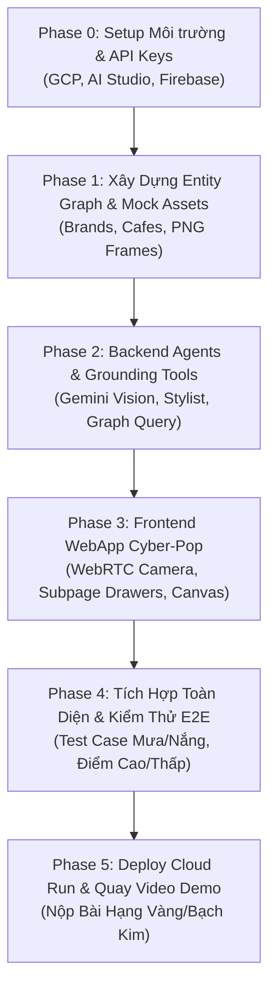

# AURALENS — KẾ HOẠCH TRIỂN KHAI TỪ A-Z (MASTER IMPLEMENTATION PLAN)
**Dự án:** AuraLens — AI Stylist Số & Bản đồ Trải nghiệm Cá nhân hóa  
**Cuộc thi:** AI Riser Vietnam 2026 · #BuildwithGoogleAI · Mục tiêu Hạng Vàng/Bạch Kim

---

## 🔑 PHẦN 1: DANH SÁCH API KEYS & TÀI NGUYÊN CẦN CHUẨN BỊ

Dưới đây là toàn bộ các tài khoản, dịch vụ và API Key cần thiết để triển khai dự án hoàn toàn trên hệ sinh thái Google (trong định mức **Zero-Cost / Free Tier**):

| STT | Tài nguyên / Dịch vụ | Nơi lấy / Cách đăng ký | Mục đích sử dụng | Bắt buộc? |
| :---: | :--- | :--- | :--- | :---: |
| **1** | **Gemini API Key (Google AI Studio)** | [aistudio.google.com](https://aistudio.google.com) | Phân tích ảnh Outfit (Multimodal) & Chạy Stylist Persona (Lumi). Miễn phí 15 RPM. | **BẮT BUỘC** |
| **2** | **Google Cloud Project (GCP)** | [console.cloud.google.com](https://console.cloud.google.com) | Khởi tạo Project ID để deploy Cloud Run và liên kết Firebase. | **BẮT BUỘC** |
| **3** | **Firebase Project & Web SDK Config** | [console.firebase.google.com](https://console.firebase.google.com) | Hosting WebApp, Firebase Auth (Anonymous/Google) & Cloud Firestore Vector Search. | **BẮT BUỘC** |
| **4** | **Google Cloud Storage Bucket** | Tạo trong GCP Console / Firebase Storage | Lưu trữ tài nguyên tĩnh Photobooth (Khung ảnh PNG, Sticker) và ảnh OOTD người dùng. | **BẮT BUỘC** |
| **5** | **Weather API Key** (OpenWeatherMap hoặc WeatherAPI) | [openweathermap.org](https://openweathermap.org/api) | Lấy thời tiết thực tế (Mưa/Nắng/Nhiệt độ) phục vụ lọc địa điểm F&B thông minh. (Có fallback mock). | Khuyến khích |
| **6** | **Google Maps Places API Key** | Google Cloud Console (APIs & Services) | Lấy thông tin địa điểm chi tiết hoặc tạo link điều hướng Google Maps trực tiếp. | Tùy chọn |

---

### Mẫu File Cấu Hình Môi Trường (`.env.example`)

```env
# ==========================================
# 1. GOOGLE AI STUDIO / GEMINI API
# ==========================================
GEMINI_API_KEY="AIzaSyYourGeminiApiKeyHere"
GEMINI_MODEL="gemini-2.5-flash" # hoặc gemini-1.5-pro / gemini-2.5-pro

# ==========================================
# 2. FIREBASE CONFIGURATION (CLIENT-SIDE)
# ==========================================
VITE_FIREBASE_API_KEY="AIzaSyYourFirebaseApiKey"
VITE_FIREBASE_AUTH_DOMAIN="auralens-project.firebaseapp.com"
VITE_FIREBASE_PROJECT_ID="auralens-project"
VITE_FIREBASE_STORAGE_BUCKET="auralens-project.appspot.com"
VITE_FIREBASE_MESSAGING_SENDER_ID="1234567890"
VITE_FIREBASE_APP_ID="1:1234567890:web:abcdef123456"

# ==========================================
# 3. EXTERNAL ENGINES & APIS
# ==========================================
WEATHER_API_KEY="your_openweather_api_key"
WEATHER_API_DEFAULT_CITY="Ho Chi Minh City,VN"

# ==========================================
# 4. SERVER & CLOUD RUN SETTINGS
# ==========================================
PORT=8080
NODE_ENV="production"
CORS_ORIGIN="*"
```

---

## 📋 PHẦN 2: LỘ TRÌNH TRIỂN KHAI TỪNG BƯỚC (PHASE 0 $\rightarrow$ PHASE 5)



---

### GIAI ĐOẠN 0: CHUẨN BỊ MÔI TRƯỜNG & TÀI KHOẢN (Ngày 1)
- [ ] **Bước 0.1:** Tạo tài khoản Google Cloud và tạo Project mới: `auralens-ai-riser`.
- [ ] **Bước 0.2:** Truy cập [Google AI Studio](https://aistudio.google.com), tạo API Key và test prompt Persona Lumi.
- [ ] **Bước 0.3:** Tạo Firebase Project liên kết với GCP Project vừa tạo:
  - Bật **Firebase Authentication** (Anonymous Provider + Google Provider).
  - Bật **Cloud Firestore Database** (chế độ Test / Production).
  - Bật **Firebase Storage** (tạo folder `/photobooth-frames` và set CORS mở).
  - Cài đặt **Firebase CLI** (`npm install -g firebase-tools`).
- [ ] **Bước 0.4:** Cài đặt `gcloud` CLI trên máy tính để sẵn sàng build container lên Cloud Run.

---

### GIAI ĐOẠN 1: MÔ HÌNH DỮ LIỆU ENTITY GRAPH & ASSETS (Ngày 2)
- [ ] **Bước 1.1: Tạo Mock Data cho Local Brands (Tối thiểu 15-20 items):**
  - Danh mục: Áo Blazer, Tube top Y2K, Quần Cargo, Kính râm Cyberpunk, Túi kẹp nách, Dây chuyền bạc.
  - Các trường: `id`, `name`, `brand_name`, `category`, `aesthetic_tag`, `color`, `price`, `image_url`, `buy_url`.
- [ ] **Bước 1.2: Tạo Mock Data cho F&B / Photospots (Tối thiểu 12-15 địa điểm tại TP.HCM):**
  - Danh mục: Cafe tone xi măng tối giản, Rooftop hoàng hôn, Quán trà phong cách Y2K, Cyberpunk Pub, Studio nghệ thuật.
  - Các trường: `id`, `name`, `type`, `aesthetic_tag`, `is_indoor` (Boolean), `open_hours` (vd: `08:00-23:00`), `address`, `signature_drink`, `best_photo_spot`, `image_url`, `maps_link`.
- [ ] **Bước 1.3: Chuẩn bị 6-8 Khung ảnh Photobooth PNG Transparent:**
  - Khung Y2K Retro Film Strip.
  - Khung Bìa Tạp Chí Thời Trang Vogue/Dazed.
  - Khung Cyberpunk Neon Grid.
  - Khung Sticker Dopamine Pop Pastel.
  - Upload lên Cloud Storage hoặc nạp trực tiếp vào thư mục `/public/frames`.

---

### GIAI ĐOẠN 2: XÂY DỰNG BACKEND & MULTI-AGENT GROUNDING (Ngày 3 - Ngày 5)
- [ ] **Bước 2.1: Khởi tạo Backend Server (FastAPI / Express.js / Node.js):**
  - Thiết lập server hỗ trợ nhận payload ảnh Base64 / Multipart Form Data.
  - Cấu hình CORS middleware cho phép WebApp gọi API.
- [ ] **Bước 2.2: Xây dựng Vision Agent (Gemini Multimodal):**
  - Viết System Prompt chuyên biệt bóc tách outfit: Màu sắc chủ đạo, Kiểu dáng, Phong cách (Y2K, Streetwear, Vintage, Minimalist), Phụ kiện hiện có.
  - Ép kiểu JSON đầu ra bằng **Gemini Structured Output (JSON Schema)**.
- [ ] **Bước 2.3: Xây dựng Stylist Agent (Lumi Persona Engine):**
  - Chấm điểm Outfit (0 - 100 điểm) dựa trên độ hài hòa và ngữ cảnh đi chơi.
  - Logic phân nhánh:
    - *Điểm < 70:* Tìm món đồ còn thiếu trong Database Local Brand để gợi ý thay thế/bổ sung.
    - *Điểm $\ge$ 70:* Khen ngợi theo ngôn ngữ Gen Z, gợi ý phụ kiện tạo điểm nhấn cực cháy.
- [ ] **Bước 2.4: Xây dựng Grounding & Weather-Aware Filter Agent (Chống AI Slop):**
  - Viết hàm lấy thời tiết hiện tại qua Weather API (nếu mưa $\rightarrow$ bắt buộc lọc `is_indoor == true`).
  - Viết hàm kiểm tra giờ hệ thống xem quán có đang mở cửa không (`open_now == true`).
  - Truy vấn danh sách quán khớp với `aesthetic_tag` của outfit.
- [ ] **Bước 2.5: Đóng gói API Endpoints:**
  - `POST /api/v1/drip-check` (Nhận ảnh + context $\rightarrow$ Trả về điểm, nhận xét, đồ gợi ý).
  - `POST /api/v1/recommend-places` (Nhận vibe + coords $\rightarrow$ Trả về danh sách quán cafe/photospot chuẩn xác).

---

### GIAI ĐOẠN 3: XÂY DỰNG FRONTEND WEBAPP CYBER-POP (Ngày 6 - Ngày 7)
- [ ] **Bước 3.1: Khởi tạo UI Design System (Vibrant Cyber-Pop & Neo-Y2K):**
  - Cài đặt TailwindCSS, Lucide React Icons, Framer Motion, Canvas-confetti.
  - Thiết lập bảng màu Dopamine: Electric Lime (`#D4FF00`), Neon Pink (`#FF2E93`), Cyan Glow (`#00F5FF`), Pearl Glass (`#FAFAFC`).
  - Nhúng Google Fonts: `Syne`, `Plus Jakarta Sans`, `Space Grotesk`.
- [ ] **Bước 3.2: Xây dựng Core Views & Subpage Sheets:**
  - **View 1 (Hero & Vibe Gate):** Banner chào đón, Lumi chat bubble, thanh chọn ngữ cảnh (Hẹn hò, Cafe sống ảo, Quẩy đêm).
  - **View 2 (Smart WebRTC Scanner):** Live Camera stream toàn màn hình, nút chụp, nút lật camera, hiệu ứng laser scan animation.
  - **View 3 (Drip Matrix Dashboard):** Vòng tròn điểm 3D neon, bảng màu chiết xuất từ outfit, Carousel đồ Local Brand + **Bottom Sheet chi tiết sản phẩm**.
  - **View 4 (Vibe Map & Smart Feed):** Widget thời tiết động, danh sách quán cafe đồng điệu + **Modal góc sống ảo & chỉ đường Google Maps**.
  - **View 5 (Aura Photobooth Studio):** Bộ chọn khung ảnh Y2K dạng tròn Instagram, chụp selfie, trộn lớp Canvas HTML5 và nút tải ảnh Story 9:16.
  - **Subpage (B2B Merchant Portal Drawer):** Giao diện thêm nhanh sản phẩm đồ & quán cafe cho đối tác.

---

### GIAI ĐOẠN 4: TÍCH HỢP & KIỂM THỬ END-TO-END (Ngày 8)
- [ ] **Bước 4.1: Kiểm thử 5 Test Case chính:**
  - *TC01 (Điểm thấp):* Upload ảnh mặc đồ ngủ $\rightarrow$ Lumi chấm < 70đ, gợi ý đổi áo Blazer.
  - *TC02 (Điểm cao):* Upload ảnh đồ Streetwear chất $\rightarrow$ Lumi chấm > 85đ, mở khóa Vibe Map.
  - *TC03 (Thời tiết Mưa):* Giả lập thời tiết mưa $\rightarrow$ 100% quán được gợi ý có máy lạnh trong nhà.
  - *TC04 (Photobooth):* Chụp ảnh lồng khung $\rightarrow$ Tải file PNG về điện thoại không bị vỡ/lệch khung.
- [ ] **Bước 4.2: Tối ưu hiệu năng & Latency:**
  - Nén ảnh trước khi gửi lên Gemini API để giảm thời gian xử lý xuống $< 2.5$ giây.
  - Đảm bảo Camera WebRTC hoạt động mượt mà trên cả Safari iOS và Chrome Android.

---

### GIAI ĐOẠN 5: DEPLOY GOOGLE CLOUD & QUAY VIDEO DEMO (Ngày 9)
- [ ] **Bước 5.1: Build & Deploy Backend lên Google Cloud Run:**
  - Viết `Dockerfile` tối ưu nhiều tầng (Multi-stage build).
  - Chạy lệnh deploy:
    ```bash
    gcloud run deploy auralens-backend \
      --source . \
      --platform managed \
      --region asia-southeast1 \
      --allow-unauthenticated \
      --set-env-vars GEMINI_API_KEY="AIzaSy..."
    ```
- [ ] **Bước 5.2: Deploy Frontend lên Firebase Hosting:**
  - Chạy lệnh build: `npm run build`.
  - Deploy: `firebase deploy --only hosting`.
- [ ] **Bước 5.3: Quay Video Demo Thuyết Trình ($\le$ 2 phút):**
  - Sử dụng 2 điện thoại hoặc 1 điện thoại + screen recording thật để quay trải nghiệm thực tế.
  - Kịch bản bám sát mục 5.2 trong `CONTEXT.md` (Điểm nhấn: UI Cyber-Pop bừng sáng, Gemini Vision, Chống AI Slop bằng dữ liệu thật, Photobooth Story 9:16).

---

## 🏆 TIÊU CHÍ ĐẢM BẢO CHIẾN THẮNG HẠNG VÀNG / BẠCH KIM
1. **Google Stack Depth:** Tích hợp sâu Google Gemini Multimodal, Google AI Studio, Cloud Run, Firebase Hosting, Firebase Auth, Cloud Storage.
2. **Zero-Cost Scalability:** Kiến trúc Serverless 100% không phát sinh chi phí duy trì, tự động co giãn.
3. **Chống AI Slop Tuyệt Đối:** Mọi quán cafe và món đồ đều được Grounding từ Entity Graph, loại bỏ ảo giác của AI.
4. **Senior UI/UX Đỉnh Cao:** Thiết kế tràn ngập năng lượng Gen Z (Vibrant Cyber-Pop), điều hướng liền mạch dạng Single Page Flow + Bottom Sheets, không trang tĩnh rườm rà.
