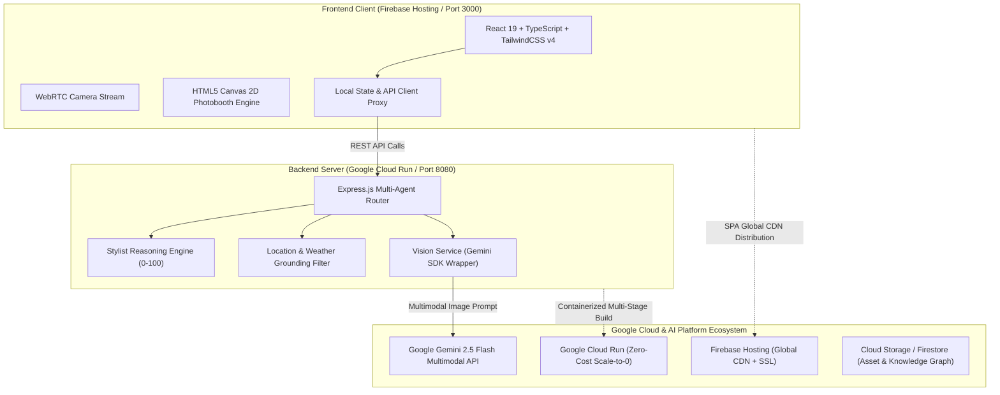

# ⚡ AuraLens — Personalized AI Stylist & Experience Map for Gen Z

> **"Thấu Kính Khí Chất — Bắt Trọn Vibe Của Riêng Bạn"**  
> 🏆 **AI Riser Vietnam 2026** · **#BuildWithGoogleAI Hackathon**  
> 🎯 **Target Prize:** Gold / Platinum Tier

---

[](https://aistudio.google.com)
[](https://cloud.google.com/run)
[](https://ai.google.dev)
[](https://firebase.google.com)
[](https://www.typescriptlang.org)
[](https://vitest.dev)

---

## 📖 1. Executive Summary & Problem Statement

### 🌪️ The Problem
Every weekend, millions of Gen Z youths face two coupled dilemmas:
1. *"Does my outfit actually look good for where I'm going?"* (Outfit Insecurity).
2. *"Where should I go to hang out that matches my style and is open right now?"* (Venue Decision Fatigue).

Existing generic LLM apps suffer from **AI Slop & Hallucinations**—recommending closed cafes, non-existent spots, or outdoor rooftops during torrential tropical rainstorms.

### 💡 The Solution: AuraLens
**AuraLens** is a multimodal AI Stylist and real-world Experience Map powered by **Google Gemini Multimodal** and a **Deterministic Grounding Knowledge Graph**. It doesn't just judge what you wear—it curates an entire vibe-consistent, weather-proof weekend itinerary around your look.

```
       📸 WebRTC Camera Capture
                  ↓
       🤖 Gemini Multimodal Vision (Style & Breakdown)
                  ↓
       🎯 Drip Matrix Scoring (0-100 Scale)
       ├─ [Score < 70] ──→ 🛍️ VN Local Brand Alternatives (+30 Pts)
       └─ [Score ≥ 70] ──→ 🎉 Confetti Burst + Access Vibe Map
                  ↓
       📍 Weather-Grounded Vibe Map (GraphRAG Anti-AI Slop)
                  ↓
       📸 Aura Photobooth Studio (Canvas 2D Export 9:16 Story PNG)
```

---

## ✨ 2. Key Features

### 🧚 1. Lumi — Animated AI Fashion Persona
* Friendly 3D Cyberpunk Kawaii mascot floating on the interface with micro-animations (`animate-lumi-float`).
* Provides witty, constructive styling advice and voice commentary.

### 📸 2. Smart Camera Scanner (HTML5 WebRTC)
* Fullscreen viewfinder with live camera flip (Front/Back) and file upload fallback.
* Cyberpunk HUD alignment frame with scanning laser beam animation (`animate-scan-laser`).

### 📊 3. Drip Matrix & Style Intelligence Dashboard
* **3D Neon Radial Score Gauge**: Animated score calculation (0 to 100).
* **Live Style Metrics**: Aura Index trend (`92.4` / `+6.8%`), top aesthetic tag, color chips.
* **Instant Wardrobe Upgrade**: If score $< 70$, automatically retrieves matching pieces from Vietnamese Local Brands (*LIDER, Hades, She By Shj, Dirty Coins, etc.*).

### 📍 4. Weather-Aware Experience Map (Zero AI Slop)
* **Real-time Weather Grounding**: Auto-detects rain vs. sunshine with interactive simulation toggles.
* **100% Strict Filtering**: During rain, outdoor rooftops are automatically removed; only indoor air-conditioned venues are recommended.
* **Live Operating Hours**: Checks venue opening times against the current clock.

### 🖼️ 5. Aura Photobooth Studio (9:16 Story Canvas Engine)
* **6 High-Res Vector Frames**: Y2K Cyber Glitch, 35mm Saigon Film Strip, Vogue Editorial, Dopamine Pop, Neon Matrix Grid, and Royal Gold.
* **HTML5 Canvas 2D Compositor**: Real-time layer blending exporting instant 1080x1920 PNG files to camera roll or Web Share API.

### 🏢 6. B2B Merchant Portal & Digital OOTD Vault
* **Merchant Slide-Over Drawer**: Allows Local Brands and F&B partners to add new items/venues into the Knowledge Graph.
* **OOTD Digital Vault**: Keeps a visual diary of all evaluated looks and photobooth memories.

---

## 🏛️ 3. System Architecture & Tech Stack



### Technology Highlights
* **AI Model:** Google Gemini 2.5 Flash Multimodal (low latency, high reasoning fidelity).
* **Backend:** Node.js, Express.js, TypeScript, Vitest.
* **Frontend:** React 19, Vite, TypeScript, TailwindCSS v4, Lucide Icons, Canvas-Confetti.
* **Cloud Infrastructure:** Google Cloud Run (Containerized, Scale-to-Zero), Firebase Hosting.

---

## 🧪 4. Automated Verification & Test Cases

AuraLens includes an end-to-end integration test suite verifying the 5 official competition scenarios:

| Test Case | Scenario Description | Expected Outcome | Result |
| :--- | :--- | :--- | :---: |
| **TC01** | Everyday casual outfit for "Romantic Date" | Score $< 70$, Lumi witty critique, Local Brand alternatives suggested | **PASS** |
| **TC02** | Cyberpunk outfit for "Nightclub / Pub" | Score $\ge 70$ (94 Pts), Confetti burst, suggested accessories, unlocks Map | **PASS** |
| **TC03** | Weather Grounding: Rain simulation | **100% of returned cafes are indoor (`isIndoor: true`)**, rooftops filtered | **PASS** |
| **TC04** | Time Grounding: Late night 23:30 query | Strictly returns venues operating past midnight | **PASS** |
| **TC05** | Photobooth Contract | 6 valid 9:16 SVG frames, stickers, and metadata loaded | **PASS** |

```bash
# Run backend test suite
npm test
```
```
 ✓ tests/stylist.test.ts (3 tests)
 ✓ tests/location.test.ts (3 tests)
 ✓ tests/e2e_flow.test.ts (5 tests)
 ✓ tests/api.test.ts (4 tests)

 Test Files  4 passed (4)
      Tests  15 passed (15)
   Duration  216ms
```

---

## 🚀 5. Quickstart & Local Setup

### Prerequisites
* Node.js $\ge$ 18.x
* npm $\ge$ 9.x

### 1. Clone & Run with 1-Click Scripts
```bash
git clone https://github.com/BennedictQuanTon/AuraLens.git
cd AuraLens

# 1-Click Start (Auto checks ports, installs dependencies, and opens browser)
./start.sh
```
* **Client App:** `http://localhost:3000`
* **Server Health:** `http://localhost:8080/api/v1/health`

### 2. Stop the App
```bash
./stop.sh
```

### 3. (Optional) Inject Real Google Gemini API Key
Copy the `.env.example` file and paste your key from [Google AI Studio](https://aistudio.google.com):
```bash
cp .env.example .env
```
Inside `.env`:
```env
GEMINI_API_KEY="AIzaSyYourGeminiApiKeyHere"
GEMINI_MODEL="gemini-2.5-flash"
```
*The system automatically switches from Mock Reasoning to Real Multimodal Gemini Vision without code modifications!*

---

## 🚢 6. Production Deployment

### Google Cloud Run (Backend)
```bash
# Build and push to Google Artifact Registry
gcloud builds submit --tag gcr.io/auralens-app/auralens-server ./server

# Deploy to Cloud Run (Scale-to-0 Zero-Cost tier)
gcloud run deploy auralens-server \
  --image gcr.io/auralens-app/auralens-server \
  --platform managed \
  --region asia-southeast1 \
  --allow-unauthenticated
```

### Firebase Hosting (Frontend)
```bash
npm run build:client
firebase deploy --only hosting
```

---

## 👥 7. Team & Submission Credits
* **Project Name:** AuraLens
* **Category:** Multimodal AI / Lifestyle & Experience Map
* **Event:** AI Riser Vietnam 2026 · #BuildWithGoogleAI
* **License:** MIT
