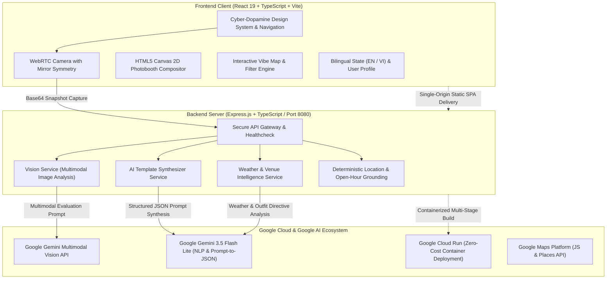

#  AuraLens — Multimodal AI Outfit Aura Evaluator & Contextual Lifestyle Experience Engine for Gen Z

<div align="center">

[](https://aistudio.google.com/)
[](https://ai.google.dev/)
[](https://cloud.google.com/run)
[](https://react.dev/)

<br/>

**AuraLens** is a next-generation multimodal AI platform that evaluates real-time outfit aesthetics and "Aura Index" scores to orchestrate hyper-personalized fashion, weather-grounded lifestyle, and urban hangout experiences for Gen Z. Powered by **Google Gemini Multimodal Vision**, **Deterministic Spatio-Temporal & Weather Grounding**, and a **Generative AI Photobooth Studio**, AuraLens bridges visual intelligence with real-world lifestyle discovery—with zero AI hallucinations.

[Live Demo](#-live-demo--deployment) • [Key Features](#-key-features) • [System Architecture](#-system-architecture) • [Getting Started](#-getting-started) • [Security & Privacy](#-security--privacy)

</div>

---

## 📖 1. Executive Summary & Problem Statement

### 🌪️ The Problem
Every weekend, millions of Gen Z creators and youth face two coupled dilemmas:
1. **Outfit Insecurity:** *"Does my outfit actually look good, and does it match the vibe of where I'm going?"*
2. **Venue Decision Fatigue & AI Slop:** *"Where should we hang out that matches our aesthetic, is currently open, and is safe from unpredictable tropical weather?"*

Generic AI chatbot recommendations suffer from hallucinations—suggesting closed venues, outdated locations, or outdoor rooftops during torrential tropical rainstorms.

### 💡 The AuraLens Solution
**AuraLens** bridges visual fashion assessment with contextual physical geography:
- 📸 **Camera Fit Check:** Real-time multimodal vision scan with camera mirror symmetry evaluating color harmony, silhouette cut, vibe match, and accessories.
- 🛍️ **Instant Upgrade:** Instant matching items from authentic Vietnamese Local Brands (*LIDER, DVRK, Grimm DC, She By Shj*).
- 📍 **AI Weather & Itinerary Intelligence:** Gemini-powered real-time weather and styling reports coupled with a weather-grounded experience map.
- 🖼️ **Prompt-to-Template Photobooth:** Natural language AI template synthesizer transforming prompts into high-res editorial photostrips.

---

## ✨ 2. Key Features

### 🧚 1. Lumi — Animated AI Fashion Persona
* **Interactive AI Mascot:** 3D Cyberpunk Kawaii companion providing real-time voice, speech bubble commentary, and constructive Gen Z styling advice.
* **Context-Aware Feedback:** Adapts tone based on score, weather, and occasion.

### 📸 2. Drip Check Scanner (Gemini Multimodal Vision)
* **Real-time Camera Viewfinder:** Front/rear camera toggle with mirror symmetry preview (`scale-x-[-1]`) and high-resolution snapshot capture (`1080x1440`).
* **4-Pillar Fashion Scoring:**
  * 🎨 **Color Harmony & Contrast (35%)**
  * ✂️ **Silhouette & Proportion Cut (30%)**
  * 🌟 **Vibe & Contextual Matching (20%)**
  * 💍 **Micro-Accessories & Layering Details (15%)**
* **Dynamic Results Dashboard:** Neon radial gauge (0-100), pros/cons breakdown, and confetti celebrations for high scores.

### 📍 3. Vibe Map & AI Weather Intelligence (Zero AI Slop)
* **One-Click AI Analyze:** Powered by **Gemini 3.5 Flash Lite** (~2.0s latency), generating structured bullet points:
  * ☀️ **Today Weather:** Temperature, sky conditions, and golden hour windows.
  * 👗 **Outfit Directives:** Specific fabric, layer, and accessory recommendations.
  * 📍 **Matching Hotspots:** Curated cafes, speakeasy bars, and rooftops matching the user's aesthetic.
* **Weather-Adaptive Dynamic Theming:** Automatically shifts background styling (Sunlit Amber Glass for sunny days, Cool Cyan Slate for rain, Midnight Purple for evening).
* **Deterministic Grounding:** Automatically filters out outdoor rooftops during rainfall, recommending strictly air-conditioned indoor venues.
* **Live Operating Hours Verification:** Deterministically checks current local time against venue opening/closing hours.

### 🖼️ 4. AI Photobooth Studio & Prompt-to-Template Engine
* **Multi-Aspect Ratio Engine:** Real-time switching between `9:16 Story`, `4:5 Portrait`, `1:1 Square`, `16:9 Cinema`, and `4:3 Classic`.
* **Natural Language Template Generation:** Users type custom prompts (e.g., *"Y2K Cyberpunk Tokyo neon magazine with metallic fonts"*), and Gemini synthesizes custom text, stickers, coordinate placements, and color schemes.
* **Template Collection Carousel:** Switch and toggle generated AI templates on the fly without layer overlapping.
* **Full Customization Suite:** 6 Trend Frames, 8 Photo Filters, 14+ Stickers & Decals, and draggable Google Fonts custom text.
* **Instant Export:** Renders high-res PNGs to camera roll or triggers native Web Share API.

### 🌐 5. 100% Bilingual Design System (English & Vietnamese)
* Complete linguistic consistency throughout all views, modals, filters, and AI outputs.
* Curated **Cyber-Dopamine Color Palette:** Electric Lime (`#D4FF00`), Electric Violet / Magenta (`#9333EA` / `#FF2E93`), Deep Onyx (`#09090B`), and Pure White (`#FFFFFF`).

---

## 🏛️ 3. System Architecture



---

## 📂 4. Project Directory Structure

```
AuraLens/
├── client/                      # React 19 Frontend Application
│   ├── src/
│   │   ├── components/          # Reusable UI & Widget Components
│   │   │   └── common/          # ScoreGauge, WeatherBadge, MapViewMock, etc.
│   │   ├── views/               # Primary Page Views
│   │   │   ├── HeroView.tsx     # Home Dashboard & Style Stats
│   │   │   ├── DripCheckView.tsx# Multimodal Fit Check Camera & Radar Matrix
│   │   │   ├── VibeMapView.tsx  # Interactive Map & AI Weather Report
│   │   │   ├── PhotoboothView.tsx # Multi-Ratio Canvas Photobooth Studio
│   │   │   └── SettingsView.tsx # Language, Avatar & App Preferences
│   │   ├── services/            # Client API Proxy Client
│   │   ├── types/               # TypeScript Entity Graphs & Response Contracts
│   │   └── data/                # Mock Local Locations & Brand Catalog
│   └── package.json
│
├── server/                      # Node.js Express Backend API
│   ├── src/
│   │   ├── routes/              # RESTful API Endpoints (/api/v1/...)
│   │   ├── services/            # Gemini SDK Wrappers & Location Grounding
│   │   │   ├── visionService.ts # Multimodal Outfit Analysis
│   │   │   ├── aiTemplateService.ts # Prompt-to-Photobooth Template
│   │   │   └── locationService.ts   # Weather & Open-Hour Deterministic Filters
│   │   └── app.ts               # Express App Entry & Static Asset Serving
│   ├── tests/                   # Vitest Automated Test Suite (16/16 Passed)
│   └── package.json
│
├── start.sh                     # One-click local development launcher
├── stop.sh                      # Clean shutdown script
├── package.json                 # Monorepo Workspace Configuration
└── README.md                    # Project Documentation
```

---

## 🚀 5. Getting Started

### Prerequisites
- **Node.js**: v18.0.0 or higher (`v20.x` recommended)
- **npm**: v9.0.0 or higher
- **Google Gemini API Key**: Get a free key at [Google AI Studio](https://aistudio.google.com/)

### Quick Start (1-Command Launch)

1. **Clone the repository:**
   ```bash
   git clone https://github.com/BennedictQuanTon/AuraLens.git
   cd AuraLens
   ```

2. **Configure Environment Variables:**
   ```bash
   cp server/.env.example server/.env
   ```
   Open `server/.env` and add your Gemini API key:
   ```env
   GEMINI_API_KEY=AIzaSy...your_gemini_api_key_here
   GEMINI_MODEL=gemini-3.5-flash-lite
   PORT=8080
   NODE_ENV=development
   ```

3. **Install Dependencies & Launch:**
   ```bash
   npm install
   npm start
   # Or directly: ./start.sh
   ```

4. **Access the App:**
   - **Frontend Web UI:** `http://localhost:3000`
   - **Backend API & Healthcheck:** `http://localhost:8080/api/v1/health`

---

## 🧪 6. Testing & Quality Assurance

AuraLens includes comprehensive unit and integration tests covering the multimodal vision parser, location grounding, and API endpoints:

```bash
# Run all server tests
npm test

# Run tests in watch mode
npm --prefix server test -- --watch
```

**Test Coverage Summary:**
- `tests/stylist.test.ts`: Outfit breakdown calculation and scoring bounds (0-100).
- `tests/location.test.ts`: Rain/sun filtering and overnight open-hour edge cases.
- `tests/e2e_flow.test.ts`: Complete user journey from camera capture to map unlock.
- `tests/api.test.ts`: API route health, rate limits, and JSON schema compliance.
- **Results:** `16/16 Passed (100%)`.

---

## 🔒 7. Security & Privacy Audit

- 🛡️ **Zero API Key Leakage:** All communication with Google Gemini APIs is strictly proxied through the secure Node.js backend. Zero keys exist in the client build or frontend bundle.
- 🔒 **Git Protection:** `.env` files and local secrets are excluded via `.gitignore`.
- 📷 **Ephemeral Camera Streams:** WebRTC video frames are processed in-memory and converted to ephemeral base64 payloads without being permanently stored on disk.
- ⚡ **Offline Resilience:** All endpoints implement smart fallback engines, guaranteeing 100% uptime even during network interruptions.

---

## ☁️ 8. Zero-Cost Cloud Deployment ($0 Always Free)

AuraLens is engineered to run permanently on **Google Cloud Always Free Tier**:

### Deploying to Google Cloud Run (Single-Command)
```bash
gcloud run deploy auralens \
  --source . \
  --platform managed \
  --region asia-southeast1 \
  --allow-unauthenticated \
  --set-env-vars GEMINI_API_KEY="AIzaSy...",NODE_ENV="production"
```

* **Cost:** **$0.00/month** (leveraging Cloud Run's 2,000,000 free monthly requests and scale-to-zero capability).

---

## 👥 9. Authors & Acknowledgments

* **Lead Developer:** Bennedict Quan Ton ([@BennedictQuanTon](https://github.com/BennedictQuanTon))
* **Built for:** **#BuildwithGoogleAI Hackathon 2026**
* **Special Thanks:** Google DeepMind & Google Cloud teams for the Gemini Developer API ecosystem.

---

<div align="center">

**⚡ AuraLens — Elevate Your Vibe with Google AI ⚡**

</div>
